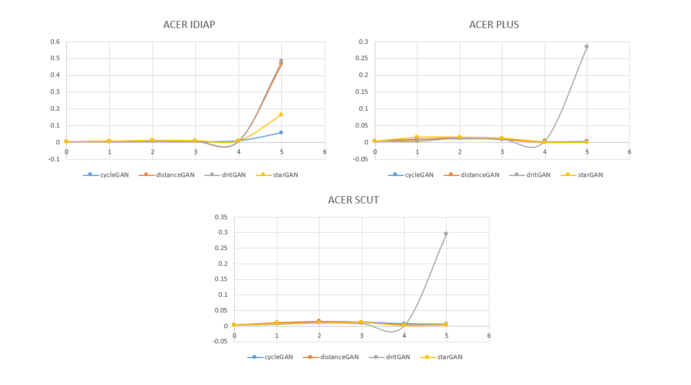
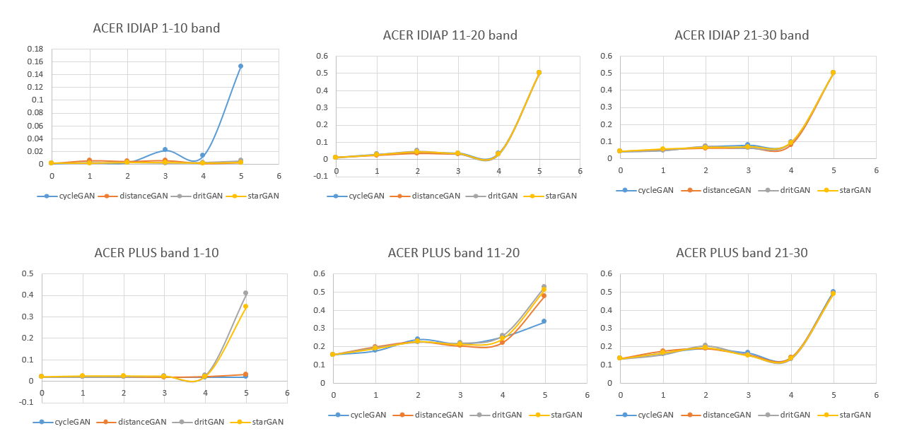
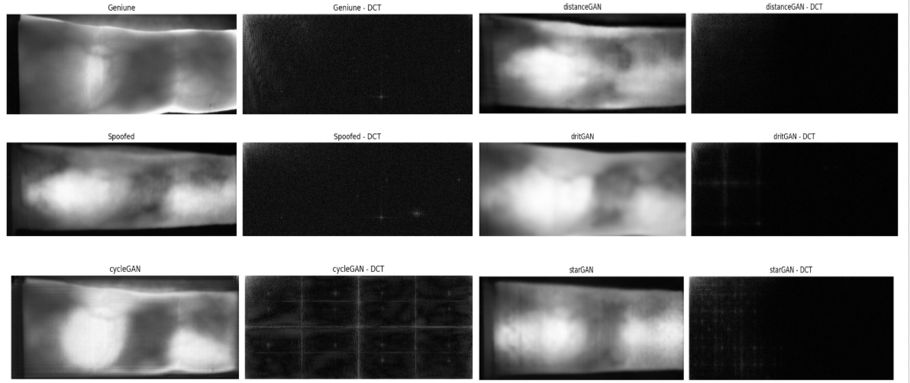

# Presentation-Attack-Detection-System
This is an implemenattion of the paper "Finger Vein Spoof GANs: Issues in Presentation Attack Detector Training", link here : https://www.cosy.sbg.ac.at/~uhl/synthPAD_SAC_fin.pdf . Here, We verify the effectiveness of PAD systems trained on Haralick features vs Fourier features from synthethically generated images to discrminate between genuine fingerprint and presentation attack instruments (PAIs).

### Features
Multi-Feature Extraction: Extracts both Fourier-based band energy and Haralick (GLCM) texture features to capture diverse image properties. For the fourier features, we extracted the energy within the first 30 bands from the DC component. With these 30 bands, we further segmented the results into 1-10, 11-20 and 21-30 bands. This was to allow us gain insight on how the classifier behaves across the results from the the low, middle and high frequency bands, respectively.

Data Preparation: Loads and labels images from different categories (genuine, spoofed, synthetic). There are three datasets provided by the paper. PLUS, IDIAP and SCUT. For the synthetic, dataset from four networks was provided namely; CyclGAN, DistanceGAN, DritGAN, and StarGAN.

Dataset Balancing: Balances real and fake classes to prevent model bias.

Robust Evaluation: Utilizes 5-fold cross-validation to rigorously test model performance across various training scenarios. For the model training we use the KNN K-Fold classification.
* The first step was divide the extracted data containing bonafide and real PAI samples into 5 folds, training with 4 folds and testing our model with 1 fold.
* Then reduce the dataset above to just ⅖ before retraining and perform the 5 fold cross validation the reduced sample.
* We further reduced the dataset to ⅕, then performing the 5-fold cross validation.
* At this point, we start to increase the training data now by replacing the real PAIs with synthetic ones.
* First by adding ⅕  to the training set, then subsequently adding another ⅗.
* Lastly, the entire training set is composed all of bonafide and synthetic samples.
* Note, the testing data is composed of only bonafide and real PAI samples across the different training modes and sizes
* Then the Attack Presentation Error Rate (APCER), the Bonafide Presentation Error Rate (BPCER) and the Average Classification Error Rate (ACER) as specified from the paper.

### The Entire Training Architecture

## Result & Analysis of Average Classification Error Rate (ACER) for Haralick Features

From the first to the third step, where the classifier was trained on only bonafide samples and real PAIs, we noticed near=perfect classification with haraclick features, with very slight increase in ACER as the training size reduced. But this reversed as soon we started augumenting the training size by adding synthetic samples from the fourth and fifth step. This happened even when the real PAI component in the training set was significantly lower than that of sythetic PAI component, highlighting the effectiveness of the use of synthetic data to augment real training set. At step six, when all the real PAI samples were replaced with synthetic samples in the training set, we observer a sharp decline in acccuracy across the different GANs. Notably, DritGAN showed very worst compared to other networks across the three datasets under observation. On the other hand, synthetic samples from CyclcGAN provided the best results for all the three datasets considered. 

## Result & Analysis of Average Classification Error Rate (ACER) for Fourier Features

With fourier features, the performance of the classifier changes signficantly when the entire real PAIs was replaced with sythetic PAIs. While it accurately classifies real (genuine and spoofed) from synthetic samples in general, it fails to reliably discriminate bona fide from synthetic PAI samples. It responded more to the embedded GAN model fingerprints than the visual similarity of the synthetic and real PAI samples. These model fingerprints are unique to the activation functions used across the network. They are often seen in the fourier domain as periodic pattern noise. Interestingly, classification done with features from the low frequency band (1-10) provided the least errors, ahead of the middle and high bands acorss the networks and datasets. For the IDIAP dataset, results from the CycleGAN samples provided the poorest results. This is a sharp contrast from what was observed from the training with Haralick features. And the overall performance of the model was very poor.

## Conclusion
This project demonstrates that the choice of feature extraction method significantly impacts a classifier's ability to generalize from synthetic to real-world data. While both Haralick and Fourier features successfully distinguish between genuine and spoofed samples, they respond differently when exposed to synthetic data.

The Haralick features, which capture fine-grained textural properties, show a robust ability to use synthetic data for training. The classifier maintains high accuracy even when a significant portion of the training set is composed of synthetic samples, highlighting the value of texture-based features for data augmentation. However, completely replacing real data with synthetic samples leads to a sharp performance drop, indicating that the synthetic data, while useful for augmentation, lacks some critical textural cues present in real images. The varying performance across different GAN models (e.g., CycleGAN outperforming Drit GAN) suggests that the type of GAN used to generate synthetic data is a crucial factor in the effectiveness of the training.

Conversely, the Fourier features, which capture frequency and periodic patterns, prove less suitable for this task. The classifier's performance degrades when trained exclusively on synthetic data, as it seems to learn and respond to the "GAN fingerprint" (a form of periodic noise) rather than the visual likeness of the synthetic and real samples. This is evidenced by the better performance of the low-frequency features, which are less likely to contain these high-frequency GAN artifacts. This stark contrast underscores a critical finding: not all synthetic data is created equal, and its usefulness for training is heavily dependent on the chosen feature representation and the specific characteristics of the noise it contains.

In summary, Haralick features showed to be a more effective choice for leveraging synthetic data to augment training sets. They capture textural information that is more consistent across real and synthetic domains, making the classifier more robust. Fourier features, while useful, appear to be overly sensitive to the embedded artifacts of the GAN model itself, limiting their utility for this specific application.

### Quickstart
Clone the repository:

Bash

git clone https://github.com/njPlanck/Presentation-Attack-Detection-System.git

Bash

### Run the Fourier feature extraction script
python scripts/extract_features_fft.py

### Run the GLCM feature extraction script
python scripts/extract_features_glcm.py
This will generate CSV files in the output_csvs/ directory.

### Run the classifier:

Note: The classifier.py script expects a single CSV file as input. You may need to modify the script to load either fft_features_all.csv or glcm_features_all.csv or a combined feature set.

Bash

python scripts/classifier.py
The script will output the performance metrics for each cross-validation step to the console.