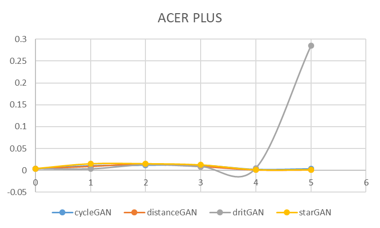
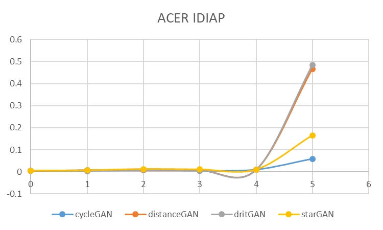
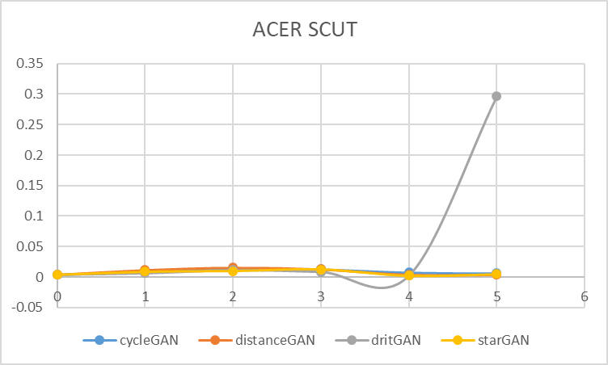

# Presentation-Attack-Detection-System
This is an implemenattion of the paper "Finger Vein Spoof GANs:
Issues in Presentation Attack Detector Training", link here : https://www.cosy.sbg.ac.at/~uhl/synthPAD_SAC_fin.pdf . We verify the effectiveness of PAD systems trained on haralick features from synthethically generated images to discrminate between bonafide fingerprint and spoofed. However, we also observed that PAD systems trained on fourier features were only capable of distinguishing real from synthetic samples, but failed to reliably discriminate bona fide from PAI sample.

### Features
Multi-Feature Extraction: Extracts both Fourier-based band energy and Haralick (GLCM) texture features to capture diverse image properties.

Data Preparation: Loads and labels images from different categories (genuine, spoofed, synthetic).

Dataset Balancing: Balances real and fake classes to prevent model bias.

Robust Evaluation: Utilizes 5-fold cross-validation to rigorously test model performance across various training scenarios. For the model training we use the KNN K-Fold classification.
* The first step was divide the extracted data containing bonafide and real PAI samples into 5 folds, training with 4 folds and testing our model with 1 fold.
* Then reduce the dataset above to just ⅖ before retraining and perform the 5 fold cross validation the reduced sample.
* We further reduced the dataset to ⅕, then performing the 5-fold cross validation.
* At this point, we start to increase the training data now by replacing the real PAIs with synthetic ones.
* First by adding ⅕  to the training set, then subsequently adding another ⅗.
* Lastly, the entire training set is composed all of bonafide and synthetic samples.
* Then the Attack Presentation Error Rate (APCER), the Bonafide Presentation Error Rate (BPCER) and the Average Classification Error Rate (ACER) as specified from the paper.

Libraries: pandas, numpy, scikit-learn, opencv-python, scikit-image, tqdm

Data Format: CSV

### Project Structure

PAD_System/
├── scripts/
│ ├── extract_features_fft.py 
│ └── extract_features_glcm.py 
│ └── classifier.py 

├── images/
│ ├── genuine/
│ ├── spoofed/ 
│ └── synthetic/ 

├── output_csvs/
│ ├── fft_features_all.csv 
│ └── glcm_features_all.csv
└── README.md

### Quickstart
Clone the repository:

Bash

git clone https://github.com/njPlanck/Presentation-Attack-Detection-System.git
cd PAD_System
Install dependencies:

Bash

pip install -r requirements.txt
Place your image data in the corresponding folders (images/genuine, images/spoofed, images/synthetic).

Run feature extraction:

Bash

### Run the Fourier feature extraction script
python scripts/extract_features_fft.py

### Run the GLCM feature extraction script
python scripts/extract_features_glcm.py
This will generate CSV files in the output_csvs/ directory.

### Run the classifier:

Note: The classifier.py script expects a single CSV file as input. You may need to modify the script to load either fft_features_all.csv or glcm_features_all.csv or a combined feature set.

Bash

python scripts/classifier.py
The script will output the performance metrics for each cross-validation step to the console.